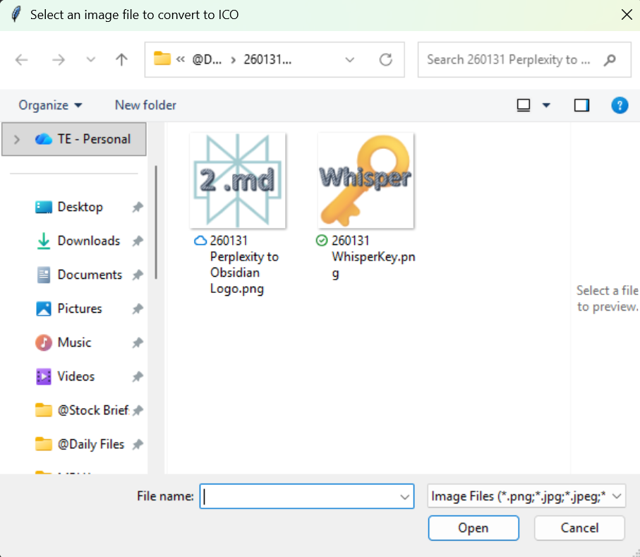

# 🖼️ PNG to ICO Converter

A Python GUI tool that converts PNG (and other image formats) to multi-resolution Windows ICO files with optional white background removal.

**Note:** ICO files are primarily a Windows icon format. This tool has been tested on Windows 11. It may work on Linux/macOS, but this is untested.

## ✨ Features

- **📁 File dialog interface** - Browse and select your image file through a graphical file picker
- **👁️ Image preview** - View your source image before conversion
- **🔍 Multi-size preview** - See how your icon will look at all sizes (16×16, 32×32, 48×48, 64×64, 128×128, 256×256) with transparency checkerboards
- **🎨 White background removal** - Optional conversion of white or near-white pixels to transparent
- **📐 Auto-padding** - Automatically pads non-square images to square with transparent borders
- **🎯 Multi-resolution output** - Creates a single .ico file containing all standard Windows icon sizes

## 📦 Installation

1. Clone this repository
2. Install dependencies:
```powershell
pip install -r requirements.txt
```

## 🚀 Usage

Run the script:
```powershell
python iconmaker.py
```

The tool will:
1. Open a file dialog to select your image (PNG, JPG, BMP, GIF, or TIFF)
2. Show a preview of your selected image
3. Display a multi-size preview showing how the icon looks at all resolutions
4. Ask if you want to convert white pixels to transparent
5. Generate the .ico file and save it to the `output/` directory

### Example



## 📤 Output

The converted ICO file includes these resolutions:
- 16×16 pixels
- 32×32 pixels
- 48×48 pixels
- 64×64 pixels
- 128×128 pixels
- 256×256 pixels

All output files are saved to the `output/` subdirectory.

## ⚙️ Requirements

- Python 3.7 or higher (developed and tested with Python 3.11, but should work with 3.7+)
- Pillow (PIL) - see requirements.txt
- tkinter (included with Python)

## 📄 License

MIT License

Copyright (c) 2026

